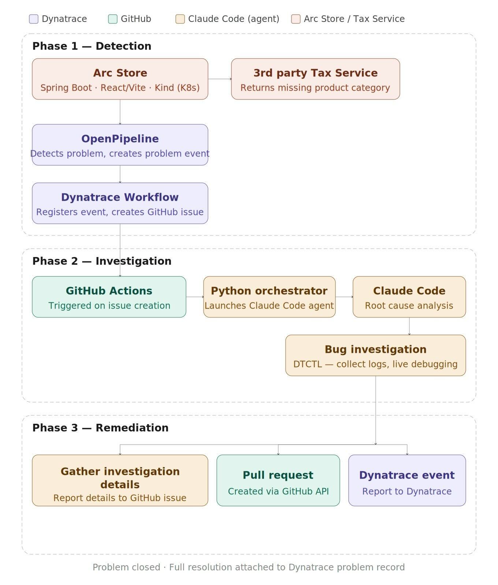

# Arc Store: Agentic Debugging Demo

--8<-- "snippets/disclaimer.md"
--8<-- "snippets/view-code.md"
--8<-- "snippets/bizevent-homepage.js"

## Overview

This demo showcases an end-to-end root cause analysis use case involving Dynatrace detecting application problems, workflows for log gathering and GitHub issue creation, and claude code for investigating the issue with the help of Dynatrace's DTCTL command line tool. 

When the **Arc Store** e-commerce app encounters an error parsing a response from the tax service, Dynatrace detects it, raises a Problem, creates a Github issue, and hands off to a **Claude Code AI agent**. The agent investigates using logs, distributed traces, and the Dynatrace Live Debugger, finds the root cause, and opens a pull request with a fix — all automatically.

## The Flow

The demo runs across three phases:

- **:material-radar: Phase 1 — Detection**

    The Arc Store calls a tax service. A parsing error triggers Dynatrace's OpenPipeline, which raises a Problem. A Dynatrace Workflow creates a GitHub issue from the problem details.

- **:material-magnify: Phase 2 — Investigation**

    The GitHub issue triggers a GitHub Action. A Python orchestrator launches Claude Code via the Agent SDK. Claude uses `dtctl` to query logs, distributed traces, and set non-breaking Live Debugger breakpoints.

- **:material-wrench: Phase 3 — Remediation**

    The agent opens a pull request with a proposed fix and supporting evidence, then posts a `CUSTOM_ANNOTATION` event back to the Dynatrace Problem to close the loop.

## Components

| Component | Technology |
|-----------|-----------|
| Arc Store frontend | React (Vite) + nginx |
| Arc Store backend | Spring Boot 3.2 |
| Tax service | External service (separate repo) |
| Kubernetes | Kind (local) |
| Observability | Dynatrace — OpenPipeline, Workflows, Live Debugger |
| AI agent | Claude Code SDK |
| Investigation CLI | dtctl |
| Automation | GitHub Actions |

- [Get Started :octicons-arrow-right-24:](getting-started.md)

